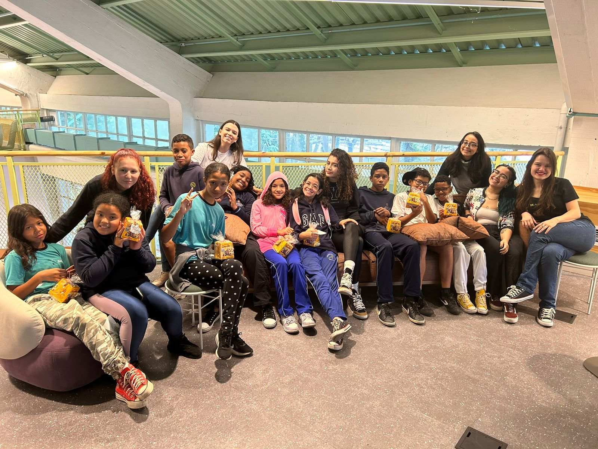

# Introdução

O CodeClub é uma iniciativa educacional dedicada a promover o aprendizado de programação e habilidades relacionadas à tecnologia entre pessoas. Este programa oferece um ambiente interativo e colaborativo, onde todos podem explorar conceitos de codificação de maneira prática e divertida.

No decorrer do último ano, este projeto foi concretizado nas instalações do Inteli (Instituto de Tecnologia e Liderança). Com o apoio dedicado de seus colaboradores e a utilização de sua infraestrutura, conduzimos 20 aulas, envolvendo um grupo de 15 alunos com idades entre 9 e 13 anos. Além disso, estabelecemos uma valiosa parceria com a CS Global, responsável por facilitar o transporte das crianças do trajeto escolar até o Inteli. Destaca-se ainda que, em cada uma das aulas, proporcionamos lanches nutritivos, generosamente doados pela Blessed Atacarejo.

No futuro, está previsto o estabelecimento de quatro classes educacionais, das quais três serão dedicadas a crianças e uma delas especialmente direcionada para pessoas com deficiência (PCD). Além disso, há a intenção de implementar programas de monitoria voltados especificamente para mulheres no ensino superior, especialmente aquelas que cursam áreas tecnológicas, visando a redução da evasão feminina.

